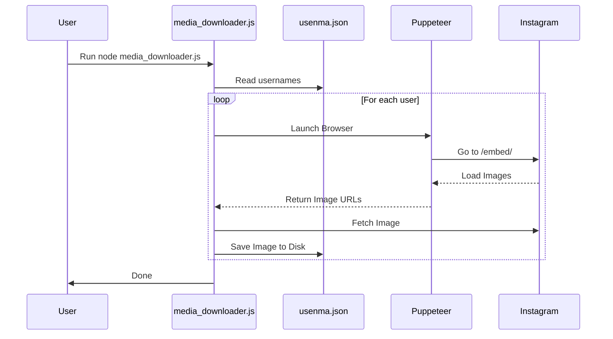
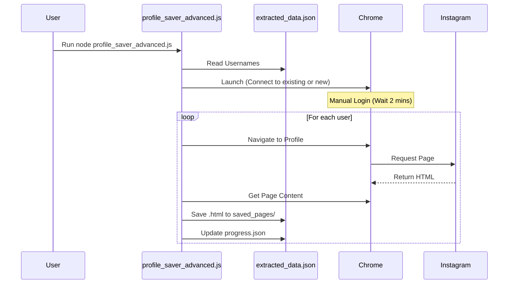
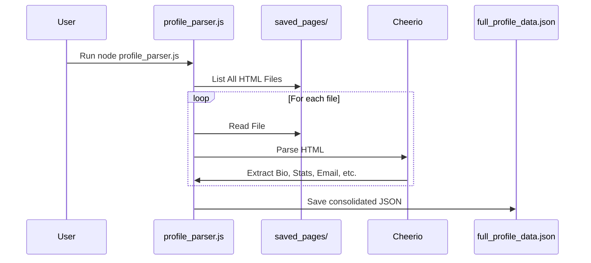
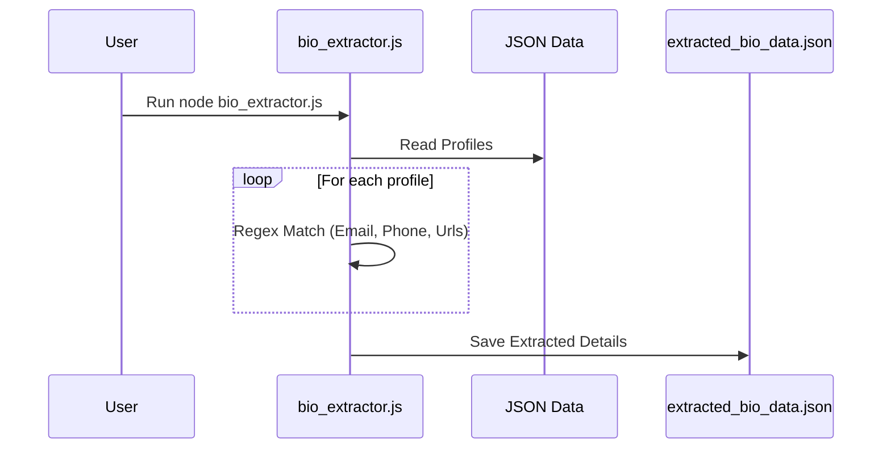

# Consolidated Instagram Scripts

This directory contains a collection of scripts for scraping, downloading, and analyzing Instagram data. The scripts have been consolidated and renamed for clarity.

## 📂 Directory Structure

- `media_downloader.js`: Downloads images from Instagram profiles using the embed method.
- `profile_saver_advanced.js`: Navigates to Instagram profiles and saves the HTML content (supports login, retries, and progress tracking).
- `profile_parser.js`: Parses saved HTML files to extract detailed profile information (Bio, Email, Phone, Interests, etc.) using Cheerio.
- `simple_extractor.js`: A lighter extractor using JSDOM for basic stats (Followers, Posts).
- `bio_extractor.js`: Post-processes extracted JSON data to parse bios for emails, phones, and keywords.
- `auto_scroll_snippet.js`: A utility snippet for auto-scrolling pages (useful for console injection).
- `input_templates/`: Contains template JSON files required by the scripts.

## 🚀 Setup

1.  **Install Node.js**: Ensure Node.js is installed on your system.
2.  **Install Dependencies**:
    ```bash
    npm install
    ```

## 📖 Usage & Sequence Diagrams

### 1. Media Downloader (`media_downloader.js`)

Downloads images from a list of users.

**Input**: `usenma.json` (List of objects with `username`)



### 2. Profile Saver (`profile_saver_advanced.js`)

Saves the HTML of profile pages for offline processing.

**Input**: `extracted_data.json` (Array of objects with `username`)
**Output**: HTML files in `saved_pages/`



### 3. Profile Parser (`profile_parser.js`)

Extracts rich data from the saved HTML files.

**Input**: `saved_pages/` (Directory of HTML files)
**Output**: `full_profile_data.json`



### 4. Bio Extractor (`bio_extractor.js`)

Analyzes the bio text from JSON data to find contact info.

**Input**: `instagram_data.json` (or `full_profile_data.json`)
**Output**: `extracted_bio_data.json`



## ⚠️ Notes
- **Authentication**: `profile_saver_advanced.js` relies on a logged-in Chrome session. You may need to adjust the `executablePath` in the script to match your system.
- **Rate Limiting**: Scripts have built-in delays to avoid getting blocked by Instagram. Do not decrease these delays.
